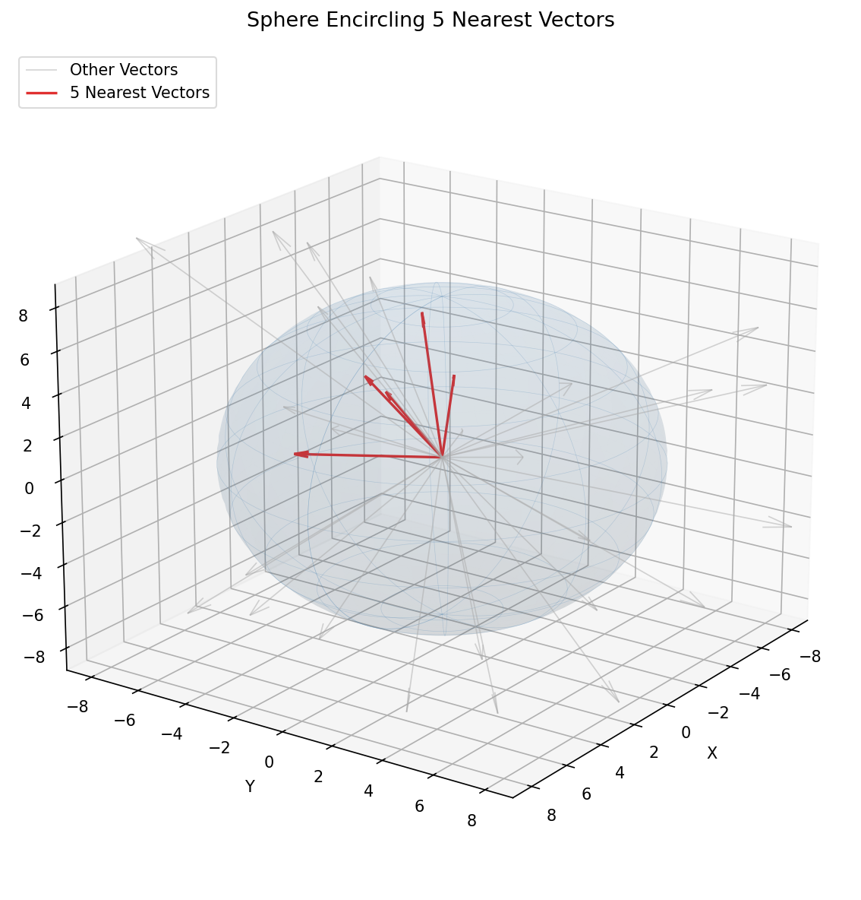

# RAG

Chatbots are trained to predict the most likely sequence of characters (tokens) that should follow a given prompt. This method of generation is in no direct way grounded in truth, which is why hallucinations happen so often. In theory, you could create a model that responds fluently in a given language by while speaking complete nonesense. In most cases, training data tends to consist of largely truthful information, so the model picks up true facts to incorporate into its answers. However, if the data is flawed, or simply new or rare, the models will respond inaccurately.

Of course, this is a problematic for anyone trying to reliably extract information out of a language model.

Retrieval-Augmented Generation is a way of solving this problem. Essentially, it's telling the model to cite its sources for everything it says. We add an external knowledge base that is retrieved from during every query, and pass the information from this knowledge base onto the language model as extra context to answer with. Of course, this still isn't bullet-proof, but it does decrease the probability of hallucinations.

Aside from reducing hallucinations, RAG can allow language models to narrow the scope of the topic being discussed, inject updated or personalized information, create better citations, and save on token usage.

## Math

All of the math behind LLMs is essentially just the same as the [math behind neural networks](https://github.com/intelligent-username/Backpropagation?tab=readme-ov-file#neural-network-basics), except at a bigger scale (with up to a few trillion parameters). RAG is just a layer on top of that which augments the response by inserting (preferably) human-written context. The math behind RAG is simply the result of adding a single 'context' term to the equation for the probability of a given token being the next token in the sequence. The context term is weighted differently than the prompt, and is added to the equation for the probability of a given token being the next token in the sequence.

### Maximum A Posteriori Estimation

Normally, when a model is trained, it's trying to find the most likely estimator of some observed data. It's looking for the best parameters (estimators) to model the relationship between features and labels. Since models are just trained on verbal data, they basically learn to predict a series of grammatically accurate sentences, with the only truth value within those sentences coming from the information that is inherently built into the language being spoken.

RAG grounds the predictions in real-world information, helping us a language model's answer with added context: we find the most likely tokens *given* the prompt and the retrieved context (which is weighted more strongly). By forcing the model to use the retrieved data in it's answer, we have more control over the truth value of the generated response. The model can still be creative but will be anchored by the retrieved information.

Mathematically, if the neural network produces the model $f(x | \theta)$, then adding the RAG would simply produce a new predictor function, $F(x | \theta, c)$, where $c$ is the retrieved context. The model is then trained to find the parameters $\theta$ that maximize the likelihood of the observed data given the prompt and the retrieved context. In training, it's taught to reduce cross-entropy loss of each token at each step, in order to reach the smallest possible Kullback-Leibler divergence between the predicted distribution and the true distribution of tokens given the prompt and the retrieved context.

[Try it Here](https://kl-divergence.netlify.app/)

### Embedding Information

Now that we understand the effect that retrieving and adding information has, all we need to do is implement a system to store and query the information accurately. This is done through embeddings. An embedding is simply when a piece of information is mapped to a high-dimensional vector space. Due to the high dimensionality, similar information ends up being mapped to similar vectors.

The math behind this is pretty simple. We use a pre-made embedder model to convert our data into embeddings. We could use a pre-made embedder or we could make one of our own. The important thing is that the embedder maps similar pieces of information to similar vectors. This is usually done by training the embedder on a large dataset of text, and using a loss function that encourages similar pieces of information to be mapped to similar vectors.

One simple example that we can create is called the Sine-Cosine Character Similarity Embedding. This embedding maps characters to points on a unit circle, where the angle of the point corresponds to the character's position in the alphabet. For example, 'a' would be mapped to (1, 0). It then scales the length of the vector based on the frequency of the character in the English language. This way, the words 'lame' and 'male' would be mapped to very similar vectors since they are composed of all the same letters. Of course, in practice, we would use a much more complex embedder that maps entire sentences or paragraphs to high-dimensional vectors, often based on meaning with additional context-dependent features (such as author/source name) being enforced, but this will suffice for demonstration purposes.

$\text{For some string } s_k:$

$$

\text{embed}(s_k) =

\begin{cases}
    {\sum_{c \in s} f(c) \cdot \cos(\theta_c)}& k \text{ odd} \\
    {\sum_{c \in s} f(c) \cdot \sin(\theta_c)}& k \text{ even}
\end{cases}

$$

where

$$
\theta_c = \frac{2 \pi (p(c)-1)}{26}, \quad p(a)=1,\,p(b)=2,\,\dots,\,p(z)=26
$$

- $s_k$ = $k$-th string to be processed  
- $(c \in s_k)$ = each character in the string  
- $f(c)$ = weight of the character ($f(c) = 1 $ for equal weighting)  
- We can add a denominator ${\Big\|\sum_{c \in s} f(c) \cdot (\cos(\theta_c), \sin(\theta_c))\Big\|}, $ to ensure that embeddings have a length 1.

Once the data is embedded, the query must be embedded as well in order to retrieve the most relevant information (vectors closest to it).

### Similarity

Once we have the embedded and query vectors, we need to find which ones are closest to the query vector.

From now on, let $v_1$ and $v_2$ be two vectors we're trying to find the distance (or 'similarity'), $d$, between.

#### Euclidean Distance

Euclidean distance is simply the straight-line distance between two points in the vector space. The smaller the distance, the more similar the two vectors are.

$$
\text{D}_{\text{Euclidean}}(v_1, v_2) = \sqrt{\sum_{i=1}^{n} (v_{1i} - v_{2i})^2}
$$

#### Dot Product

When vectors are already normalized to have length 1, we can use the dot product to see how much they 'align' with each other.

$$
\text{D}_{\text{Dot}}(v_1, v_2) = \sum_{i=1}^{n} v_{1i} \cdot v_{2i}
$$

#### Cosine Similarity

Cosine similarity finds the cosine of the angle between two vectors. If we restrict the domain to $[0, \pi]$ (or even if we don't), then the cosine of the angle between any two vectors will be in the range $[-1, 1]$, telling us how much they align.

Since we won't directly have the angle between two vectors, we can use the dot product and the lengths of the vectors to find the cosine similarity. The larger the cosine similarity, the more similar the two vectors are.

$$
\text{D}_{\text{Cosine}}(v_1, v_2) = \frac{\sum_{i=1}^{n} v_{1i} \cdot v_{2i}}{\sqrt{\sum_{i=1}^{n} v_{1i}^2} \cdot \sqrt{\sum_{i=1}^{n} v_{2i}^2}}
$$

#### Hamming Distance

Hamming distance is simply the number of positions at which the corresponding elements are different. This is only applicable for binary vectors.

$$
\text{D}_{\text{Hamming}}(v_1, v_2) = \sum_{i=1}^{n} \mathbf{1}_{v_{1i} \neq v_{2i}}
$$

#### Learned Similarity

In some cases, a whole new neural network is trained just for finding the similarity between two vectors. This is usually done by training the network on a large dataset of pairs of vectors, and using a loss function that encourages similar pairs to be mapped to similar vectors.

$$
\text{D}_{\text{Learned}}(v_1, v_2) = \text{NN}(v_1, v_2)
$$

Cosine similarity is used most often. For more general details on similarity metrics, read [this](https://github.com/intelligent-username/Similarity-Metrics).

Once we understand this simple math, we can implement RAG in a few simple steps. For this explanation, the existence of a sufficient language model is assumed, and the focus will be on the retrieval process.

## Implementation

### Chunking and Indexing

Chunking is when we break up the data into smaller pieces. Oftentimes, we'll split the same source with multiple chunk sizes. For example, if we're adding a work like Aristotle's Ethics, we might split it into chunks of singular sentences, fully paragraphs, and ~400 word blocks. This way, we can retrieve more specific information when needed, but also have the option to retrieve more general information when necessary.

Indexing simply refers to the process of creating the embeddings and storing them in a database for retrieval.

An interesting field of research is that of chunking and indexing strategies. For example, if we know that a given input is very long, instead of storing the vectors as floating-point numbers, we could store them as binary vectors, which would allow us to store more information in the same amount of space. Interestingly, although this leads to a massive loss in what information is embedding, it empirically has been shown to not affect the accuracy much if the given input is long enough. Another interesting strategy is to use a hierarchical indexing system, where we have multiple levels of embeddings that are stored in different databases.

### Vector Databases

Our embeddings are stored efficiently in what's called a vector database. This is a database that is optimized for storing and querying high-dimensional vectors. It allows us to quickly find the most similar vectors to a given query vector, which is essential for retrieving the relevant context for our language model.

### Searching

Once the embeddings are finished, we take in a query. The query is then also temporarily embedded into the same vector space.

We look for the top-k most similar vector to this newly embedded 'query vector'. The closest neighbours are found using one of the similarity metrics mentioned earlier. We then add the retrieved information to the prompt and feed it into the language model to generate a response. We may want to give preference to shorter or longer chunks of retrieved information, and, if adding more than one result, we may want to order them in a specific way (for example, from most similar to least similar) while filtering out repeats (i.e. same piece of a chunk appearing in multiple results). There are cases where we want to conduct an approximate search in order to save on time.

### Fine-Tuning

Although many language models are decently well-equipped to work with references out of the box, some may require fine-tuning in order to ensure that a proper, standardized structure of responses is enforced. This can be done by outright LoRA fine-tuning, meta-prompting, or generic supervised fine-tuning.

## Modifications and Advancements

Now, for cutting-edge applications, the following additions improve the process.

### Prompt Augmentation

Prompt augmentation is when we add additional information to the prompt in order to tell the model what format to respond in. One example would be "start the response with a quote".

### Multimodal Retrieval

Multi-modal retrieval is when we have multiple types of data embedded in the same vector space. For example, images and text can be embedded in the same vector space. This is actually a difficult task, as it requires alignment to be created between different types of data within the same vector space. It's an active area of research, and there are a lot of different approaches to it. One approach is to use a shared encoder for both types of data, and then fine-tune it on a multi-modal dataset. Another approach is to use separate encoders for each type of data, and then learn a mapping between the two vector spaces.

### Self-RAG

The model learns when and what to retrieve on its own, without human intervention. This is a more advanced form of RAG that bakes the retrieval process into the model itself.

### Multi-Hop and Reflective RAG

Multi-hop is when the model retrieves data multiple times. It critiques the first response, and then retrieves more data to improve the response, and continues iterating. Reflective RAG is when the model critiques its own response and then retrieves more data to improve it.

## Applications

### Narrowing Contexts

For example, 'answer this prompt like [X author]' to force the model to only use writings from a given author.

### Updated Information

When a model is trained, it's almost as though it's "learning" certain information about the world. If this information becomes outdated, RAG can ensure that more updated information is always available.

### Citation Enforcement

If we simply force the model to always include retrieved information in its response, then it will organically cite (more reliable, human source for) every claim that it makes. This is especially useful for academic writing, where citations are essential.

### User-Specific Customization

If we feed the user's data into the vector database, we can provided personalized responses.

### PageIndex

PageIndex is another approach to RAG that provides a document with a reliable Table of Contents to an LLM and expects it to scan through the document to find the relevant portions. This doesn't require any embeddings or vector databases, however it is still more expensive since tokens have to be used just to read the document and the model is less likely to find relevant information from disparate sections of the context.

## Project

To demonstrate RAG, I've implemented a simple RAG-based chatbot that's deployed with a small LLM. It's designed to answer questions based on specific philosophies. For example, if you ask it a question about the nature of reality from the perspective of Plato, it will respond based on Plato's works.

A more interesting future project could be to create an RAG-based Resume writier to customize a resume based on the role's requirements, with the user's personal experiences, projects, etc. as the knowledge base. The model would have to be fine-tuned to write in a specific style and stick to one-line bull points.

## Credit

This project was inspired by the paper ["Retrieval-Augmented Generation for Knowledge-Intensive NLP Tasks"](https://arxiv.org/abs/2005.11401) by Patrick Lewis, et al (v4; last revised 12 April 2021).
